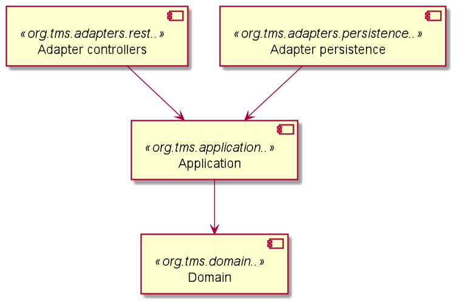

# ArchUnit

Ejemplo de proyecto de gestión de coches para su venta bajo arquitectura Onion (refinamiento de la arquitectura de puertos-adaptadores) validada usando test de ArchUnit.

## Construido con 🛠️

* [Sprint boot](https://spring.io/projects/spring-boot) - aplicacion Spring
* [Maven](https://maven.apache.org/) - Manejador de dependencias
* [Archunit](https://www.archunit.org/userguide/html/000_Index.html) - test de arquitectura

## Arquitectura

La aplicación consta de tres capas, a saber:
* *Domain* (dominio): Sería la más interna, donde figura la entidad inmutable de dominio *Car* (coche)
  y la lógica de negocio que la utiliza (en este ejemplo no se ha implementado)
  modelada independientemente de la infraestructura y el framework.
* *Application* (aplicación): Esta capa incluye los servicios necesarios para interactuar con la aplicación (casos de uso). Cada uno de ellos debe implementar una interfaz (*VehicleSalesService*) que contiene un único método con un único parámetro.
Esta capa contiene la información de los coches encapsuladas en un objeto *dto* y solo depende de la capa de dominio para comprobar que esos datos pueden instanciar un coche correctamente que pueda utilizarse en la lógica de negocio.
La idea es que después, este coche pueda ser persistido y recuerado comunicandose con la capa de adaptadores, para ello utiliza una interfaz independiente de la base de datos y su modelo (*CarSalesPort*).
* *Adapters* (adaptadores): Esta capa se subdivide en dos módulos independientes entre si. Uno para la comunicación vía http mediante una api rest y otro para la persistencia asíncrona de coches en mongoDB (documentos).
Cambiar cualquiera de estos adaptadores (reemplazando rest por una comunicación publicación-suscripción por ejemplo (kafka, rabbitMQ...), o la persistencia a una base de datos relacional (postgresql, oracle...)) no implica ningún cambio en el resto de capas.

## Tests

Las pruebas de ArchUnit se pueden encontrar en el paquete *architecture* en src/test/java/architecture. Se pueden ejecutar como pruebas unitarias regulares con:

    mvn test

## Autores ✒️

* **Fabián Sanchez Ruiz**
* **Fco.Javier Escalada Sarabia**
* **Juan Antonio Breña Moral**
